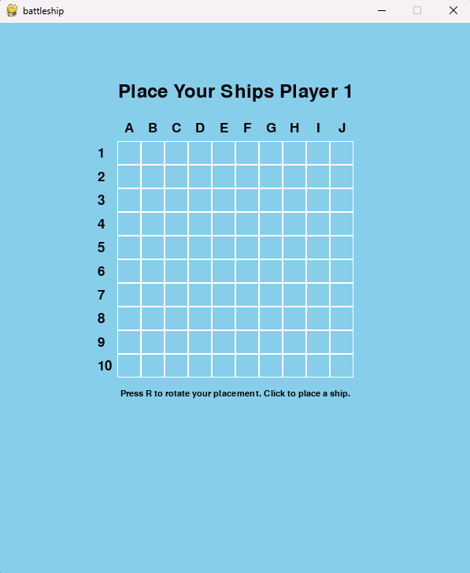
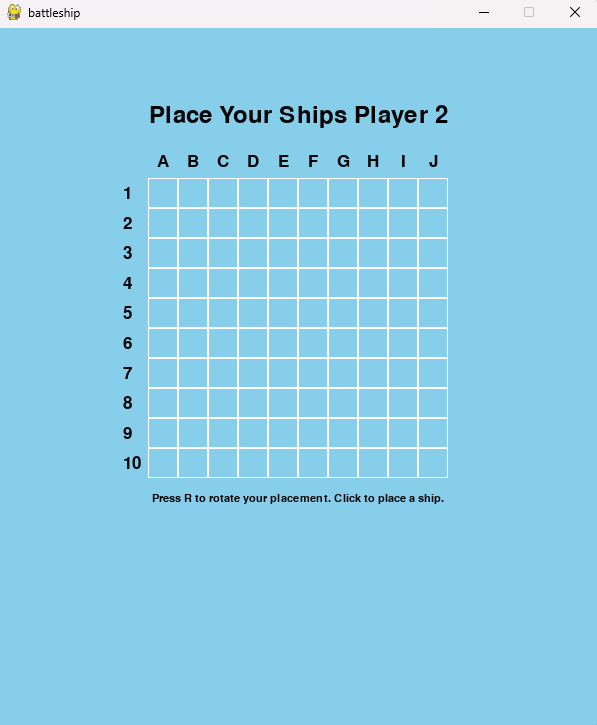
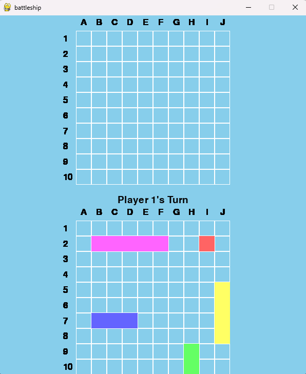
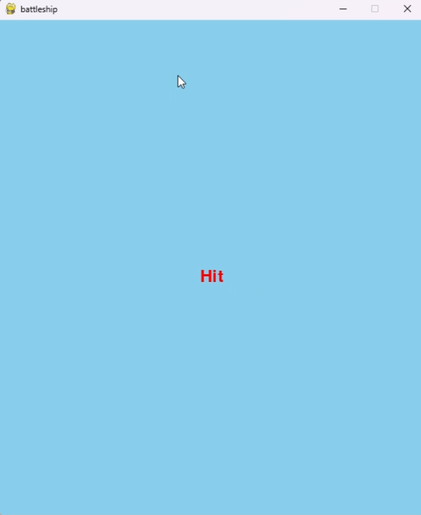
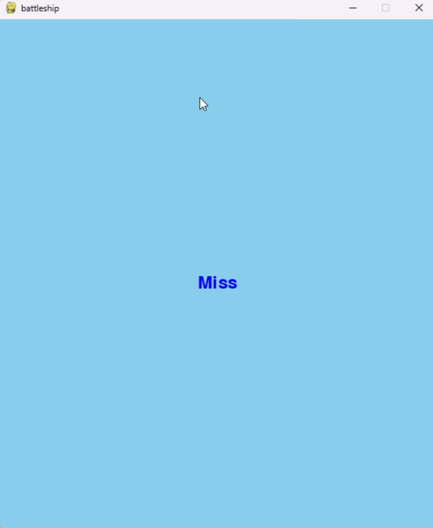
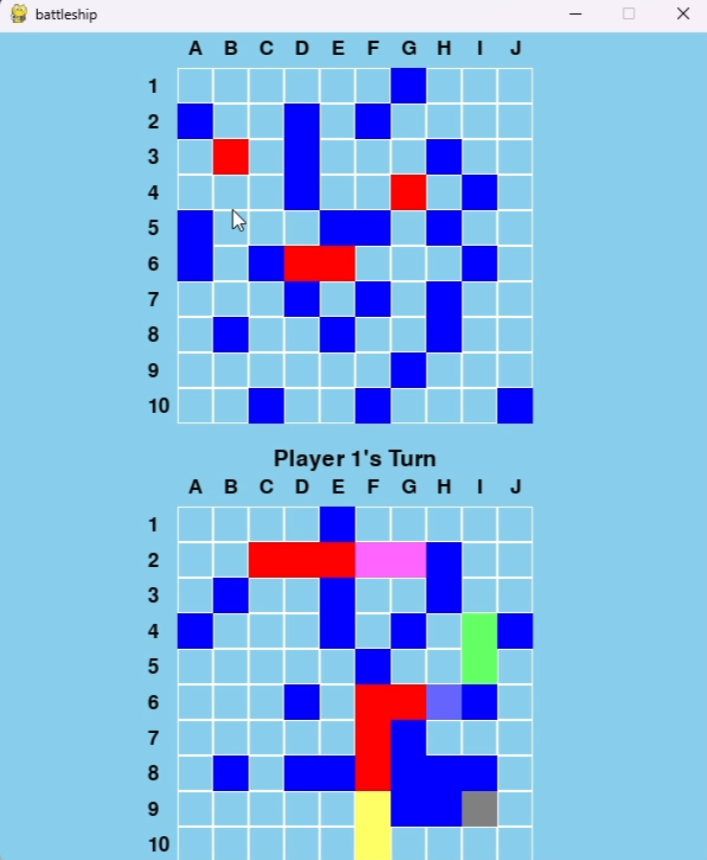
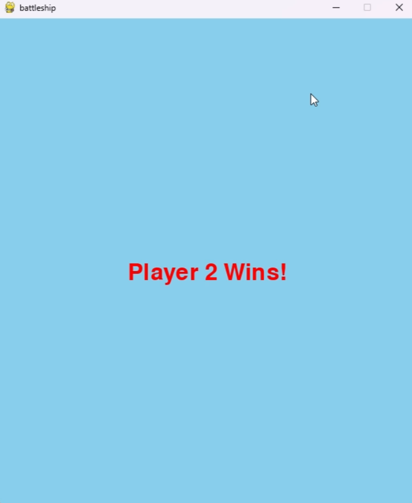

# Battleship Game (EECS 581 Project 1)

A Python implementation of the classic battleship game using the pygame library. The game supports 1-2 players, allowing you to place ships on a grid and take turns guessing the positions of the opponent's ships.

## Features

- **User Interface:** Simple UI to select the number of ships, place them, and take turns.
- **Grid System:** 10x10 grid where ships can be placed horizontally or vertically.
- **Interactive Ship Placement:** Rotate ships and place them by clicking on the grid.
- **Turn-Based Gameplay:** Players take turns to guess the location of opponent ships.

## Screenshots










## How to Play

1. **Select Ships:** Choose the number of ships (1-5) using the up and down arrow keys and press Enter to start.
2. **Place Ships:** Each player will place their ships on the grid. Press `R` to rotate a ship and click on the grid to place it.
3. **Take Turns:** Players take turns guessing the positions of the opponent's ships by clicking on the grid.

## Installation

1. Clone the repository:

   ```python
   git clone https://github.com/lakerpack/eecs581Proj1.git
   ```

2. Install the required dependencies:

   ```python
   pip install -r requirements.txt
   ```

3. Run the game:

   ```python
   python game.py
   ```

## Controls

- **Arrow Keys:** Adjust the number of ships before starting.
- **R Key:** Rotate the ship during placement.
- **Mouse Click:** Place a ship or make a guess on the opponent’s board.

## Future Improvements

- Add sound effects for hits, misses, and ship placements.
- Add AI for single-player mode against the computer.
- Improve visuals.

## Contributing

- **Coders:** Anil, Michelle, Nathan
- **Tester:** Justin
-  **Documentation:** Jaret
